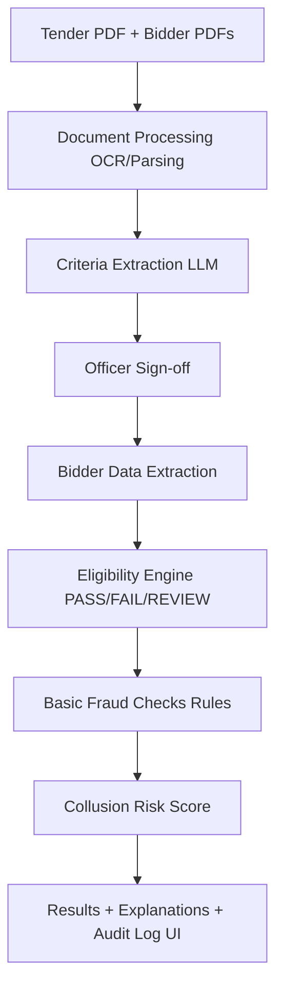

# BidShield 

BidShield is an AI-powered procurement fraud detection system designed to identify bid-rigging, collusion, and anomalies in government tenders.

## Architecture



##  Getting Started

### Prerequisites
- Node.js (for the frontend)
- Python 3.10+ (for the backend)

### Backend Setup (Server)
1. Navigate to the server directory:
   ```bash
   cd server
   ```
2. Create a virtual environment:
   ```bash
   python -m venv venv
   ```
3. Activate the virtual environment:
   - Windows: `venv\Scripts\activate`
   - Mac/Linux: `source venv/bin/activate`
4. Install dependencies:
   ```bash
   pip install -r requirements.txt
   ```
5. Run the FastAPI server:
   ```bash
   uvicorn main:app --reload
   ```

### Frontend Setup (Client)
1. Navigate to the client directory:
   ```bash
   cd client
   ```
2. Install dependencies:
   ```bash
   npm install
   ```
3. Run the development server:
   ```bash
   npm run dev
   ```

## 🛠️ Tech Stack
- **Frontend**: Next.js 15+, React 19, Tailwind CSS 4, Lucide React, Recharts
- **Backend**: FastAPI, Python, OCR/PDF Parsing tools
- **AI/ML**: LLMs for criteria extraction and risk scoring

## ⚖️ Features
- **OCR Integration**: Extract data from unstructured tender and bidder PDFs.
- **Automated Eligibility**: Instantly verify bidder compliance against tender requirements.
- **Fraud Detection**: Rule-based and AI-driven checks for collusion and bid-rigging.
- **Audit Logs**: Full transparency for procurement officers.